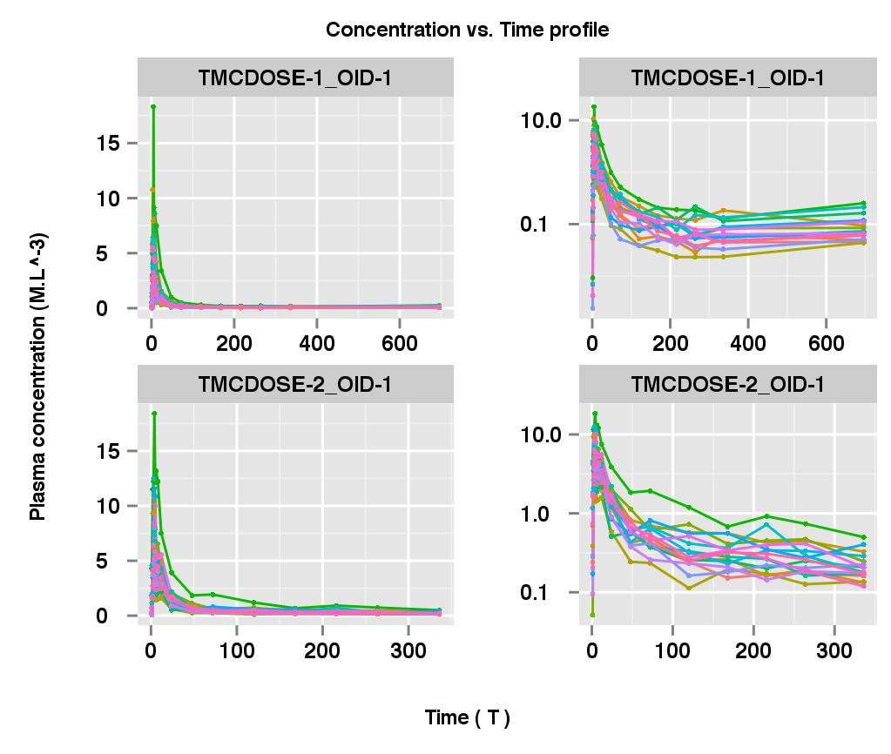

## Tabular output  
### ncaOutput.tsv  
The ***ncappc*** functionality produces this table to report the estimated values of the NCA metrics described in the previous section for each individual along with other stratifiers (eg. population group ID, dose ID, etc.) if specified in the input command. The extension "tsv" stands for "tab separated variable", *i.e.*, the columns in this table are separated by tabs. "NaN" or "NA" is produced for the NCA metrics which are irrelevant for the specified data type.

If simulated data is provided, this table also reports three additional columns for each of the eight NCA metrics that can be used for the diagnostics (AUClast, AUMClast, AUClower_upper, Tmax, Cmax, HL_Lambda_z, AUCINF_obs, AUCINF_pred). The names of the additional columns for AUClast are simAUClast, dAUClast and npdeAUClast. simAUClast for an individual represents the mean of the estimated AUClast values obtained from the set of simulated data. dAUClast for an individual represents the deviation of the mean of the simulated AUClast values from the AUClast value obtained from the observed data, scaled by the "spread" of the simulated distribution as described in the corresponding command-line argument. npdeAUClast for an individual represents the NPDE value of AUClast estimated from the simulated data with respect to the value of AUClast estimated from the observed data. Similar names are assigned to the additional columns for the other seven metrics.

### Obs\_Stat.tsv  
This table reports a set of statistical parameters calculated for the entire population or the stratified population for the following NCA metrics estimated from the observed data: Tmax, Cmax, AUClast, AUClower_upper, AUCINF_obs, AUC_pExtrap_obs, AUCINF_pred, AUC_pExtrap_pred, AUMClast, AUMCINF_obs, AUMC_pExtrap_obs, AUMCINF_pred, AUMC_pExtrap_pred, HL_Lambda_z, Rsq, Rsq_adjusted and No_points_Lambda_z. Brief description of the twelve statistical parameters reported for each NCA metric is given below.
  * Ntot = Total number of data points, Nunique = number of unique data points
  * Min = minimum value
  * Max = maximum value
  * Mean = mean or average value
  * SD = standard deviation
  * SE = standard error
  * CVp = coefficient of variation %
  * a95CIu = upper limit of 95% arithmetic confidence interval
  * a95CIl = lower limit of 95% arithmetic confidence interval
  * gMean = geometric mean
  * gCVp = geometric coefficient of variation %.

### Sim\_Stat.tsv  
This table reports a set of statistical parameters calculated for the entire population or the stratified population for the mean values of the following NCA metrics estimated from the simulated data: Tmax, Cmax, AUClast, AUClower_upper, AUCINF_obs, AUC_pExtrap_obs, AUCINF_pred, AUC_pExtrap_pred, AUMClast, AUMCINF_obs, AUMC_pExtrap_obs, AUMCINF_pred, AUMC_pExtrap_pred, HL_Lambda_z, Rsq, Rsq_adjusted and No_points_Lambda_z. Brief description of the twelve statistical parameters reported for each NCA metric is given below.
  * Ntot = Total number of data points, Nunique = number of unique data points
  * Min = minimum value
  * Max = maximum value
  * Mean = mean or average value
  * SD = standard deviation
  * SE = standard error
  * CVp = coefficient of variation %
  * a95CIu = upper limit of 95% arithmetic confidence interval
  * a95CIl = lower limit of 95% arithmetic confidence interval
  * gMean = geometric mean
  * gCVp = geometric coefficient of variation %.

### ncaSimData.tsv  
This table reports the simulated concentration-time profiles for each individual obtained from a number of simulations. Currently the ***ncappc*** function accepts only NONMEM output format for the simulated data. All columns from the NONMEM output file are kept unaltered in this file and an additional column, namely "NSUB", is printed to denote the corresponding simulation number for the concentration-time profile.

### ncaSimEst.tsv  
This table reports the estimated NCA metrics values for each individual obtained from the simulated concentration-time profiles. The number of the reported values for each individual for each NCA metric is equal to the number of simmulations performed. "NSUB" column denotes the simulation number. "NaN" or "NA" is produced for the NCA metrics which are irrelevant for the specified data type.

## Graphical output
### [Individual level] Concentration *vs.* time profile  
  

Concentration vs time profile for each individual stratified by dose or population group, if any, as obtained from the observed data. The left panels represent the raw data, while the right panels represent the semi-logarithmic form of the concentration data. Each of the lines represents individual data.

### [Population level] Histogram of the selected NCA metrics estimated from the observed data  
  

Histogram of four selected NCA metrics (AUClast, AUCINF\_obs, Cmax, Tmax) estimated from the observed data. The solid blue vertical and dotted lines represent the population mean and the "spread" of the data. The "spread" is defined by \Sexpr{sprtxt} obtained from the observed data.

### [Population level] Histogram of the simulated population means of the NCA metrics  
  

Histogram of the population mean of the NCA metrics obtained from the simulated data. The red and blue solid vertical lines represent the population mean of the NCA metric obtained from the observed data and the mean of the population means of the same NCA metric obtained from the simulated data, respectively. The blue dashed vertical lines represent the "spread" of the simulated distribution. The "spread" is defined as either defined by the standard deviation or by the 95% nonparametric prediction interval for the population mean of the NCA metrics obtained from the simulated data.

### [Individual level] Deviation of the simulated NCA metrics from the observed value  
  

Deviation of the mean of the NCA metrics for each individual estimated from the simulated data (meanSim) from the corresponding values estimated from the observed data (Obs). The deviation is scaled by the boundary of the "spread" of the simulated data proximal to the observed value (** Deviation = (Obs - meanSim)/ spread **). The negative value of the deviation signifies over-prediction of the corresponding NCA metric, while a positive value of the deviation signifies under-prediction of the same.

### [Individual level] Distribution of the simulated NCA metrics for the outliers}  
  

Distribution of the NCA metrics obtained from the simulated data for the outlier individuals. The individuals are labeled as outliers because the absolute value of the scaled deviation for at least one of the NCA metrics used in diagnosis is larger than 1. The red and blue solid vertical lines represent the observed NCA metric value and the mean of the simulated NCA metric values for that individual, respectively. The dashed blue vertical lines represent the "spread" of the simulated distribution.

### [Population level] Forest plot for the NPDE type analysis  
  

Forest plot of the NPDE type analysis displaying the mean and standard deviation of the NPDE vaues of the NCA metrics for different population groups. The red and green dots represent the mean and the standard deviation of the NPDE, respectively while the horizontal red and green lines represent the corresponding 95% confidence intervals.

### [Individual level] NPDE values of the NCA metrics for each individual  
  

NPDE values of the NCA metrics for each individual within a given population group calculated from the corresponding observed and simulated values of the NCA metrics. The negative value of the NPDE signifies over-prediction of the corresponding NCA metric, while a positive value of the NPDE signifies under-prediction of the same.

### [Population level] Histogram of the NPDE values of the NCA metrics within a given population group
  

Histogram of the NPDE values of the NCA metrics for all individuals within a given population group. The red solid vertical represents the mean of the ideal NPDE distribution, which is the theoretical normal distribution (mean=0, SD=1). The blue solid vertical lines represent the mean of the NPDE distribution for the corresponding population group. The dashed blue vertical lines represent the standard deviation of the distribution of the NPDE values within that population group.
