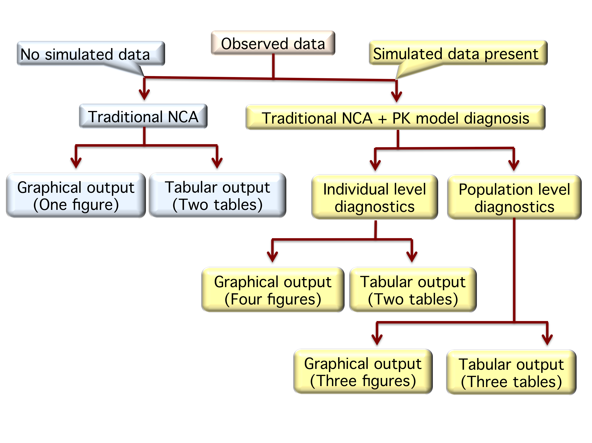

# Introduction
**Usage: ncappc (path=, obsFile=, ...)**



**Figure 1.** Schematic work-flow of ***ncappc***.

The ***ncappc*** functionality is a flexible tool in R to,
 * perform NCA
 * perform simulation-based posterior predictive checks for a population PK model using NCA metrics.

The work-flow of ***ncappc*** is shown in Figure 1. In order to perform NCA, the only mandatory argument is *obsFile*, which is the name of the file with the observed concentration vs. time data. Other arguments may be assigned to the desired values, if required.

In the presence of the non-empty simFile argument (NONMEM output file with the simulated concentration vs. time data) ***ncappc*** function performs the diagnostic tests for the related PK model besides performing the traditional NCA. This function creates a directory, called "SIMDATA", to store the estimated NCA metrics from the simulated data. If the working directory contains any directory called "SIMDATA", this function offers the following three options to the user:
  * Press 1 to overwrite the existing directory
  * Press 2 to rename the existing "SIMDATA" directory. The "SIMDATA" will be renamed to "SIMDATA_PREVIOUS" and a new directory called "SIMDATA" will be created
  * Press 3 to reuse the data from the existing "SIMDATA" directory. The "SIMDATA" directory must contain the files created by ***ncappc*** previously using the NONMEM simulation output.


# Command-line arguments
```{r argument, child = 'Sub-CommandLineArguments.Rmd', echo=FALSE}
```

# Estimated NCA metrics
```{r definition, child = 'Sub-EstimatedNCAmetrics.Rmd', echo=FALSE}
```

# Estimation method
```{r method, child = 'Sub-EstimationMethod.Rmd', echo=FALSE}
```

# Output
```{r output, child = 'Sub-Output.Rmd', echo=FALSE}
```
