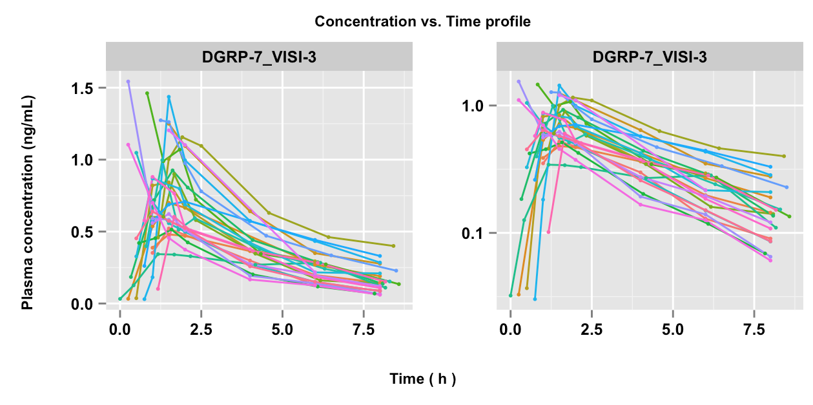
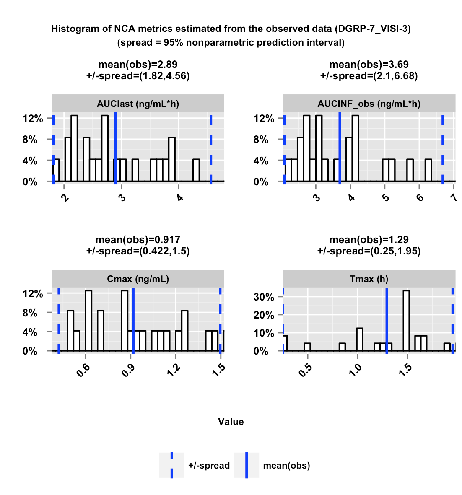

```{r setup, include=FALSE}
library(knitr)
library(ncappc)
library(tibble)
library(dplyr)
opts_chunk$set(echo = FALSE, comment=NA, tidy = TRUE, 
               fig.align = 'center',
               fig.show='asis', out.width='90%', fig.pos='H')
```

# Introduction

The ***ncappc*** package is a flexible tool in R to:

 * perform non-compartmental analysis (NCA)
 * perform simulation-based posterior predictive checks (PPC) for population models using NCA metrics.

The main tool of the  ***ncappc*** 
package is the function  ```ncappc()```. In order to perform a traditional NCA, the only mandatory argument to the function is the ```obsFile``` argument, which is the name of the file with the observed concentration vs. time data. 

```{r,echo=TRUE,eval=FALSE}
ncappc(obsFile = "file_with_observations.txt")
```

The above command will compute NCA statstics on all individuals in the file and output a report on the results as shown in the workflow in Figure 1.  

```{r,out.height='90%',out.width='90%',fig.align='center',fig.cap="**Figure 1:** Schematic work-flow of the ```ncappc()``` function in the ***ncappc*** package.",echo = FALSE}
knitr::include_graphics('./ncappc-Schema.png')
```

Options to how the NCA statistics will be computed and if the report should be generated are available, see ```?ncappc```.   For example, the following code only computes the NCA metrics and outputs that to an R object:

```{r,echo=TRUE,tidy=FALSE}
data_1 <- tibble(
  ID=1,
  TIME = c(0,0.25,0.5,1,1.5,2,3,4,6,8,12,16,24),
  DV=c(0, 0.07, 0.14, 0.21, 0.24, 0.27, 0.26, 0.25, 0.22, 0.19, 0.13, 0.081, 0.033)
)
  
  
out <- ncappc(obsFile=data_1,
              onlyNCA = T,
              extrapolate = T,
              printOut = F,
              evid = FALSE,
              noPlot = T)

out$ncaOutput %>% select(c(AUClast,AUCINF_pred,Cmax,Tmax))
```

In the presence of the non-empty ```simFile``` argument (simulated concentration vs. time data) the ```ncappc()``` function performs diagnostic tests for the related PK model in addition to performing the traditional NCA. For example, if you have a model defined in NONMEM, then you could produce simulated datasets using the PsN command:

```{bash,echo=TRUE,eval=FALSE}
nca run1.mod -samples=1000 -columns=EVID,DOSE -dir=nca_ex_1
```

In the created directory then you can create the NCA metrics as well as a PPC of those metrics using the following command:
```{r,echo=TRUE,eval=FALSE}
ncappc(concUnit="ng/ml", doseAmtNm = "DOSE") 
```


<!-- # Command-line arguments -->
<!-- ```{r argument, child = 'Sub-CommandLineArguments.Rmd', echo=FALSE} -->
<!-- ``` -->

# Estimated NCA metrics

NCA metrics are estimated according to traditional PK calculations. The names of the various NCA metrics estimated in this package are assigned mainly following the names used in WinNonlin. This package accepts any of the three different types of drug administration, (i) iv-bolus, (ii) iv-infusion and (iii) extra-vascular; ***ncappc*** 
also can accept both non-steady state and steady-state data. The NCA metrics that are estimated and reported by ***ncappc*** are listed below.

**C0**  
C0 is the initial concentration at the dosing time. It is the observed concentration at the dosing time, if available. Otherwise it is approximated using the following rules. For iv-bolus data, log-linear back-extrapolation (*see "backExtrap" argument*) is performed from the first two observations to estimate C0, provided the local slope is negative. However, if the slope is >=0 or at least one of the first two concentrations is 0, the first non-zero concentration is used as C0. For other types of administration, C0 is equal to 0 for non steady-state data and for steady-state data the minimum value observed between the dosing intervals is used to estimate C0, provided the "backExtrap" argument is set to "yes".

**Cmax, Tmax and Cmax_D**  
Cmax and Tmax are the value and the time of maximum observed concentration, respectively. If the maximum concentration is not unique, the first maximum is used. For steady state data, The maximum value between the dosing intervals is considered. Cmax_D is the dose normalized maximum observed concentration.

**Clast and Tlast**  
Clast and Tlast are the last measurable positive concentration and the corresponding time, respectively.

**AUClast**  
The area under the concentration vs. time curve from the first observed to last measurable concentration.

**AUMClast**  
The area under the first moment of the concentration vs. time curve from the first observed to last measurable concentration.

**MRTlast**  
Mean residence time from the first observed to last measurable concentration. For non-infusion models,  
$MRTlast = \frac{AUMClast}{AUClast}$  
For infusion models,  
$MRTlast = \frac{AUMClast}{AUClast}-\frac{TI}{2}$  
where TI is the infusion duration.

**No_points_Lambda_z**  
No_points_Lambda_z is the number of observed data points used to determine the best fitting regression line in the elimination phase.

**AUC_pBack_Ext_obs and AUC_pBack_Ext_pred**  
The percentage of AUC that is contributed by the back extrapolation to estimate C0. The rules to to estimate C0 is given above.

**AUClower_upper**  
The AUC under the concentration-time profile within the user-specified window of time provided as the "AUCTimeRange" argument. In case of empty "AUCTimeRange" argument, AUClower_upper is equal to the AUClast.

**Rsq, Rsq_adjusted and Corr_XY**  
Regression coefficient of the regression line used to estimate the elimination rate constant. Rsq_adjusted is the adjusted value of Rsq given by the following relation.  
$Rsq\_adjusted = 1-\frac{(1-Rsq^2)*(n-1)}{n-2}$  
where *n* is the number of points in the regression line. Corr_XY is the square root of Rsq.

**Lambda_z**  
Elimination rate constant estimated from the regression line representing the terminal phase of the concentration-time profile. The relation between the slope of the regression line and Lambda_z is:  
$Lambda\_z = -(slope)$

**Lambda_lower and Lambda_upper**  
Lower and upper limit of the time values from the concentration-time profile used to estimate Lambda_z, respectively, in case the "LambdaTimeRange" is used to specify the time range.

**HL_Lambda_z**  
Terminal half-life of the drug:  
$HL\_Lambda\_z = \frac{ln2}{\lambda_z}$

**AUCINF_obs and AUCINF_obs_D**  
AUC estimated from the first sampled data extrapolated to ${\infty}$. The extrapolation in the terminal phase is based on the last observed concentration (${Clast_obs}$). The equation used for the estimation is given below.  
$AUCINF\_obs = AUClast+\frac{Clast\_obs}{\lambda_z}$  
AUCINF_obs_D is the dose normalized AUCINF_obs.

**AUC_pExtrap_obs**  
Percentage of the AUCINF_obs that is contributed by the extrapolation from the last sampling time to ${\infty}$.  
$AUC\_pExtrap\_obs = \frac{AUCINF\_obs-AUClast}{AUCINF\_obs}*100\%$

**AUMCINF_obs**  
AUMC estimated from the first sampled data extrapolated to ${\infty}$. The extrapolation in the terminal phase is based on the last observed concentration. The equation used for the estimation is given below.  
$AUMCINF\_obs = AUMClast+\frac{Tlast*Clast\_obs}{\lambda_z}+\frac{Clast\_obs}{\lambda_{z}^2}$

**AUMC_pExtrap_obs**  
Percentage of the AUMCINF_obs that is contributed by the extrapolation from the last sampling time to ${\infty}$.  
$AUMC\_pExtrap\_obs = \frac{AUMCINF\_obs-AUMClast}{AUMCINF\_obs}*100\%$

**Vz_obs**  
Volume of distribution estimated based on total AUC using the following equation.  
$Vz\_obs = \frac{Dose}{\lambda_z*AUCINF\_obs}$

**Cl_obs**  
Total body clearance.
$Cl\_obs = \frac{Dose}{AUCINF\_obs}$

**AUCINF_pred and AUCINF_pred_D**  
AUC from the first sampled data extrapolated to ${\infty}$. The extrapolation in the terminal phase is based on the last predicted concentration obtained from the regression line used to estimate Lambda_z (${Clast\_pred}$). The equation used for the estimation is given below.  
$AUCINF\_pred = AUClast+\frac{Clast\_pred}{\lambda_z}$  
AUCINF_pred_D is the dose normalized AUCINF_pred.

**AUC_pExtrap_pred**  
Percentage of the AUCINF_pred that is contributed by the extrapolation from the last sampling time to ${\infty}$.  
$AUC\_pExtrap\_pred = \frac{AUCINF\_pred-AUClast}{AUCINF\_pred}*100\%$

**AUMCINF_pred**  
AUMC estimated from the first sampled data extrapolated to ${\infty}$. The extrapolation in the terminal phase is based on the last predicted concentration obtained from the regression line used to estimate Lambda_z (${Clast\_pred}$). The equation used for the estimation is given below.  

$AUMCINF\_pred = AUMClast+\frac{Tlast*Clast\_pred}{\lambda_z}+\frac{Clast\_pred}{\lambda_{z}^2}$  

**AUMC_pExtrap_pred**  
Percentage of the AUMCINF_pred that is contributed by the extrapolation from the last sampling time to ${\infty}$.  
$AUMC\_pExtrap\_pred = \frac{AUMCINF\_pred-AUMClast}{AUMCINF\_pred}*100\%$  

**Vz_pred**  
Volume of distribution estimated based on total AUC using the following equation.  
$Vz\_pred = \frac{Dose}{\lambda_z*AUCINF\_pred}$  

**Cl_pred**  
Total body clearance.  
$Cl\_pred = \frac{Dose}{AUCINF\_pred}$

**MRTINF_obs**  
Mean residence time from the first sampled time extrapolated to ${\infty}$ based on the last observed concentration (${Clast\_obs}$).  
For non-infusion non steady-state data:  
$MRTINF\_obs = \frac{AUMCINF\_obs}{AUCINF\_obs}$  
For infusion non steady-state data:  
$MRTINF\_obs = \frac{AUMCINF\_obs}{AUCINF\_obs}-\frac{TI}{2}$  
where ${TI}$ is the infusion duration. For non-infusion steady-state data:  
$MRTINF\_obs = \frac{AUMCINF\_obs|_{0}^{\tau}+\tau*(AUCINF\_obs-AUC|_{0}^{\tau})}{AUCINF\_obs|_{0}^{\tau}}$  
For infusion steady-state data:  
$MRTINF\_obs = \frac{AUMCINF\_obs|_{0}^{\tau}+\tau*(AUCINF\_obs-AUC|_{0}^{\tau})}{AUCINF\_obs|_{0}^{\tau}}-\frac{TI}{2}$  
For steady-state data ${\tau}$ represents the dosing interval.

**MRTINF_pred**  
Mean residence time from the first sampled time extrapolated to ${\infty}$ based on the last predicted concentration obtained from the regression line used to estimate Lambda_z (${Clast\_pred}$).  
For non-infusion non steady-state data:  
$MRTINF\_pred = \frac{AUMCINF\_pred}{AUCINF\_pred}$  
For infusion non steady-state data:  
$MRTINF\_pred = \frac{AUMCINF\_pred}{AUCINF\_pred}-\frac{TI}{2}$  
where ${TI}$ is the infusion duration.  
For non-infusion steady-state data:  
$MRTINF\_pred = \frac{AUMCINF\_pred|_{0}^{\tau}+\tau*(AUCINF\_pred-AUC|_{0}^{\tau})}{AUCINF\_pred|_{0}^{\tau}}$  
For infusion steady-state data:  
$MRTINF\_pred = \frac{AUMCINF\_pred|_{0}^{\tau}+\tau*(AUCINF\_pred-AUC|_{0}^{\tau})}{AUCINF\_pred|_{0}^{\tau}}-\frac{TI}{2}$  
For steady-state data ${\tau}$ represents the dosing interval.

**Vss_obs and Vss_pred**  
An estimate of the volume of distribution at steady-state.  
$Vss\_obs = MRTINF\_obs*Cl\_obs$  
$Vss\_pred = MRTINF\_pred*Cl\_pred$  

**Tau**  
The dosing interval for steady-state data. This value is assumed to be the same over multiple doses.

**Cmin and Tmin**  
Cmin is the minimum concentration between 0 and Tau and Tmin is the corresponding time for steady-state data.

**Cavg**  
The average concentration between 0 and Tau for steady-state data.  
$Cavg = \frac{AUC|_{0}^{Tau}}{Tau}$

**p_Fluctuation**  
Percentage of the fluctuation of the concentration between 0 and Tau for steady-state data.  
$p\_Fluctuation = \frac{Cmax-Cmin}{Cavg}*100\%$

**Accumulation_Index**  
$Accumulation\_Index = \frac{1}{1-e^{-\lambda_{z}*\tau}}$  

**Clss**  
An estimate of the total body clearance for steady-state data.  
$Clss = \frac{Dose}{AUC|_{0}^{\tau}}$


# Estimation method

**Area Under the Curve**  
AUC can be estimated using either the linear trapezoidal method or the log-linear trapezoidal method. It is shown that linear approximation is a better method to estimate of the area under a curve at the positive or zero local slopes (increasing concentration or at the peak), while the log-linear approximation is the method of choice to estimate of the area under a curve at the negative local slope (decreasing concentration) assuming that the plasma concentration decline mono-exponentially in the elimination phase. There are three different options available in ***ncappc***: “linear”, “log”, and “linearup-logdown”. The user can choose any of these three methods for the estimating the area under the zero-order moment (AUClast) and first-order moment (AUMClast) curves between the first and the last sampling time. If the lower and upper limit of the time range is provided, AUC is also calculated for that specified window of time (AUClower_upper).

The "linear" option under the argument, namely "method" allows the function to employ linear trapezoidal approximation (Equations 1 and 2) to estimate the area under the zero and first order moment curves.  

$AUC|_{i}^{i+1} = \frac{C_{i+1}+C_{i}}{2}*\Delta{t}$, if $C_{i+1} \geq C_{i}$ (Equation 1)  

$AUMC|_{i}^{i+1} = \frac{(C_{i+1}*t_{i+1})+(C_{i}*t_{i})}{2}*\Delta{t}$, if $C_{i+1} \geq C_{i}$ (Equation 2)  

The “log” options employ the log trapezoidal approximation (Equations 3 and 4) to estimate the area under the zero and first order moment curves.  

$AUC|_{i}^{i+1} = \frac{C_{i+1}-C_{i}}{ln(\frac{C_{i+1}}{C_{i}})}*\Delta{t}$, if $C_{i+1} < C_{i}$ (Equation 3)  
$AUMC|_{i}^{i+1} = \frac{(C_{i+1}*t_{i+1})-(C_{i}*t_{i})}{ln(\frac{C_{i+1}}{C_{i}})}*\Delta{t}-\frac{C_{i+1}-C_{i}}{ln(\frac{C_{i+1}}{C_{i}})}*\Delta{t}^2$, if $ßC_{i+1} < C_{i}$ (Equation 4)  

The “log-linear” option employs the linear trapezoidal approximation for the increasing concentration between two consecutive observations or at the peak concentration, while it uses the log trapezoidal approximation at the declining concentration between two consecutive observations.

\paragraph{}
where, ${C_i}$ is the plasma concentration at time ${t_i}$, ${\Delta{t}}$ is ${t_{i+1}-t_{i}}$ and ${n}$ is the number of data points. Each estimated segment of AUC and AUMC is added to obtain AUClast and AUMClast, respectively.

\subsection{Extrapolation in the elimination phase} \label{subsection}
The plasma concentration of the drug in the elimination phase is assumed to follow the mono-exponential decay with the rate of elimination, Lambda_z. The extrapolation of the plasma concentration from the last sampling time to infinity is performed based on the regression line estimated from the elimination phase data. All concentration data after Cmax are considered as the elimination phase data. The following steps are performed to determine the optimum regression line representing the plasma concentration in the elimination phase. First, a regression line is obtained from the last three non-zero concentrations in the elimination phase and the regression coefficient or ${R^2}$ (Rsq) and Adjusted ${R^2}$ (Rsq_adjusted) are calculated. Next, one data point at a time upto Cmax is added to the set and the corresponding Rsq and Rsq_adjusted are calculated each time. In order to extrapolate the NCA metrics from the last observed value to infinity in the terminal phase, the ***ncappc*** functionality requires the following two criteria to be satisfied.  
  * Minimum three non-zero concentrations in the elimination phase
  * At least one of the combinations of data points in the elimination phase yields negative slope for the corresponding regression line  

If any individual in the data set does not satisfy the above mention criteria, the NCA metrics for that individual are not extrapolated to infinity for the elimination phase. Othrwise, the regression line yielding the highest Rsq_adjusted is used to estimate Lambda_z. If there is any other regression line that yields Rsq_adjustzed within 0.0001 of the highest Rsq_adjusted and includes larger number of data points, that regression line is used to estimate Lambda_z. Lambda_z is estimated as the negative of the slope of the selected regression line representing the elimination phase of the concentration profile (Equation 5). The number of points used to determine the Lambda_z is called No_points_Lambda_z. It is possible to specify the lower and upper limit on time for the calculation of the regression line in the elimination phase (Lambda_z_lower and Lambda_z_upper, respectively).

$Lambda\_z = -(slope) = \frac{ln(Clast)-ln(Clast-k)}{Tlast-(Tlast-k)}$ (Equation 5)  

where ${k+1}$ is the number of data points out of ${n}$ data samples that are used to calculate the regression line representing the elimination phase. Clast is the plasma concentration corresponding to the last sampled time Tlast. The elimination half-life (HL_Lambda_z) is calculated from Lambda_z using Equation 6.

$HL\_Lambda\_z = \frac{log2}{Lambda\_z}$ (Equation 6)  


# Output


## Tabular output

A number of tables are produced from the ***ncappc*** 
tool.  Descriptions of these tables are below.  All tables are shown in the produced report and as tab separated value (.tsv) files, *i.e.*, the columns in the tables are separated by tabs.  "NaN" or "NA" is produced if a metric or value is irrelevant for a specified data type or case.


### ncaOutput.tsv  

The estimated values of the NCA metrics for each individual along with other stratifiers (eg. population group ID, dose ID, etc.) if specified in the input command. If simulated data is provided, this table also reports three additional columns for each of the NCA metrics that can be used for diagnostics. sim[metric_name] represents the median of the metric obtained from the set of simulated data. d[metric_name] represents the deviation of the median of the simulated metrics from the metric obtained from the observed data, scaled by the "spread" of the simulated distribution (as defined in the "spread" argument of the ncappc function). npde[metric_name] represents the NPDE value of the metric estimated from the simulated data with respect to the observed data.

### ObsStat.tsv  

A set of statistical parameters calculated for the entire population or the stratified population for the NCA metrics estimated from the *observed data*. Calculated statistical parameters are: 

* **Ntot:** Total number of data points 
* **Nunique:**  number of unique data points
* **Min:** minimum value
* **Max:** maximum value
* **Mean:**  mean/average value
* **SD:**  standard deviation
* **SE:** standard error
* **CVp:**  coefficient of variation in percent
* **a95CIu:** upper limit of 95% arithmetic confidence interval
* **a95CIl:** lower limit of 95% arithmetic confidence interval
* **gMean:** geometric mean
* **gCVp:** geometric coefficient of variation in percent.

### SimStat.tsv 
A set of statistical parameters calculated for the entire population or the stratified population for the NCA metrics estimated from the *simulated data*. The table is structured as "ObsStat.tsv".

### ncaSimData.tsv  
This table reports the simulated concentration-time profiles for each individual obtained from a number of simulations. Currently the ***ncappc*** function accepts only NONMEM output format for the simulated data. All columns from the NONMEM output file are kept unaltered in this file and an additional column, namely "NSUB", is printed to denote the corresponding simulation number for the concentration-time profile.

### ncaSimEst.tsv  
Estimated NCA metrics for each individual using the simulated concentration-time profile obtained from each simulation. The "NSUB" column denotes the simulation number.

## Graphical output
### [Individual level] Concentration *vs.* time profile  
  

Concentration vs time profile for each individual stratified by dose or population group, if any, as obtained from the observed data. The left panels represent the raw data, while the right panels represent the semi-logarithmic form of the concentration data. Each of the lines represents individual data.


### [Population level] Histogram of the selected NCA metrics estimated from the observed data  
  

Histogram of four selected NCA metrics (AUClast, AUCINF\_obs, Cmax, Tmax) estimated from the observed data. The solid blue vertical and dotted lines represent the population mean and the "spread" of the data. The "spread" is defined by \Sexpr{sprtxt} obtained from the observed data.


### [Population level] Histogram of the simulated population means of the NCA metrics  
  

Histogram of the population mean of the NCA metrics obtained from the simulated data. The red and blue solid vertical lines represent the population mean of the NCA metric obtained from the observed data and the mean of the population means of the same NCA metric obtained from the simulated data, respectively. The blue dashed vertical lines represent the "spread" of the simulated distribution. The "spread" is defined as either defined by the standard deviation or by the 95% nonparametric prediction interval for the population mean of the NCA metrics obtained from the simulated data.


### [Individual level] Deviation of the simulated NCA metrics from the observed value  
  

Deviation of the mean of the NCA metrics for each individual estimated from the simulated data (meanSim) from the corresponding values estimated from the observed data (Obs). The deviation is scaled by the boundary of the "spread" of the simulated data proximal to the observed value (** Deviation = (Obs - meanSim)/ spread **). The negative value of the deviation signifies over-prediction of the corresponding NCA metric, while a positive value of the deviation signifies under-prediction of the same.


### [Individual level] Distribution of the simulated NCA metrics for the outliers}  
  

Distribution of the NCA metrics obtained from the simulated data for the outlier individuals. The individuals are labeled as outliers because the absolute value of the scaled deviation for at least one of the NCA metrics used in diagnosis is larger than 1. The red and blue solid vertical lines represent the observed NCA metric value and the mean of the simulated NCA metric values for that individual, respectively. The dashed blue vertical lines represent the "spread" of the simulated distribution.


### [Population level] Histogram of the NPDE values of the NCA metrics within a given population group
  

Histogram of the NPDE values of the NCA metrics for all individuals within a given population group. The red solid vertical represents the mean of the ideal NPDE distribution, which is the theoretical normal distribution (mean=0, SD=1). The blue solid vertical lines represent the mean of the NPDE distribution for the corresponding population group. The dashed blue vertical lines represent the standard deviation of the distribution of the NPDE values within that population group.


### [Population level] Forest plot for the NPDE type analysis  
  

Forest plot of the NPDE type analysis displaying the mean and standard deviation of the NPDE vaues of the NCA metrics for different population groups. The red and green dots represent the mean and the standard deviation of the NPDE, respectively while the horizontal red and green lines represent the corresponding 95% confidence intervals.


### [Individual level] NPDE values of the NCA metrics for each individual  
  

NPDE values of the NCA metrics for each individual within a given population group calculated from the corresponding observed and simulated values of the NCA metrics. The negative value of the NPDE signifies over-prediction of the corresponding NCA metric, while a positive value of the NPDE signifies under-prediction of the same.

