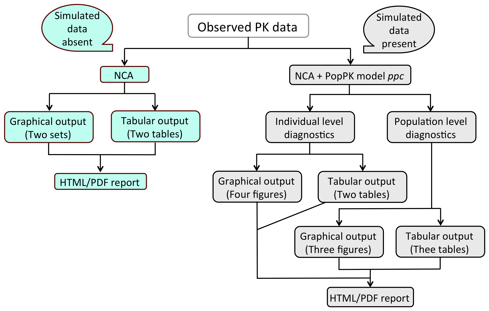

# Introduction
**Usage: ncappc (obsFile=, ...)**

**Figure 1.** Schematic work-flow of ***ncappc***.

The ***ncappc*** functionality is a flexible tool in R to,
 * perform NCA
 * perform simulation-based posterior predictive checks for a population PK model using NCA metrics.

The work-flow of ***ncappc*** is shown in Figure 1. In order to perform NCA, the only mandatory argument is *obsFile*, which is the name of the file with the observed concentration vs. time data. Other arguments may be assigned to the desired values, if required.

In the presence of the non-empty simFile argument (NONMEM output file with the simulated concentration vs. time data) ***ncappc*** function performs the diagnostic tests for the related PK model besides performing the traditional NCA. This function creates a directory, called "SIMDATA", to store the estimated NCA metrics from the simulated data. If the working directory contains any directory called "SIMDATA", this function offers the following three options to the user:
  * Press 1 to overwrite the existing directory
  * Press 2 to rename the existing "SIMDATA" directory. The "SIMDATA" will be renamed to "SIMDATA_PREVIOUS" and a new directory called "SIMDATA" will be created
  * Press 3 to reuse the data from the existing "SIMDATA" directory. The "SIMDATA" directory must contain the files created by ***ncappc*** previously using the NONMEM simulation output.

# Command-line arguments

**Name** | **Description** | **Example of possible values** | **Default**
:-------:|:---------------:|:------------------------------:|:-----------:
obsFile | Observed concentration-time data from an internal data frame or an external table with comma, tab or space as separator | File name or data frame | *NULL*
simFile | Observed concentration-time data in NONMEM format from an internal data frame or an external table | File name or data frame | **NULL**
str1Nm | Column name for 1st level population stratifier | Column name | **NULL**
str1 | Stratification ID within 1st level stratification | c(1,2) | **NULL**
str2Nm | Column name for 2nd level population stratifier | Column name | **NULL**
str2 | Stratification ID within 2nd level stratification | c(1,2) | **NULL**
str3Nm | Column name for 3rd level population stratifier | **NULL**
str3 | Stratification ID within 3rd level stratification | c(1,2) | **NULL**
concUnit | Unit of concentration | "ng/mL" | **"[M].[L]^-3"**
timeUnit | Unit of time | "h" | **"[T]"**
doseUnit | Unit of dose amount | "mg" | **"[M]"**
doseNormUnit | Normalization factor of dose amount if used | kg | **NULL**
obsLog | Concentration in observed data in logarithmic form | TRUE or FALSE | **FALSE**
simLog | Concentration in simulated data in logarithmic form | TRUE or FALSE | **FALSE**
psnOut | observed data is an output from PsN or in NONMEM output format | TRUE or FALSE | **FALSE**
idNmObs | Column name for ID in observed data | Column name | **"ID"**
timeNmObs | Column name for time in observed data | Column name | **"TIME"**
concNmObs | Column name for concentration in observed data | Column name | **"DV"**
idNmSim | Column name for ID in simulated data | Column name | **"ID"**
timeNmSim | Column name for time in simulated data | Column name | **"TIME"**
concNmSim | Column name for concentration in simulated data | Column name | **"DV"**
AUCTimeRange | User-defined window of time used to estimate AUC | c(0,24) | **NULL**
backExtrp | If back-extrapolation is needed for AUC | TRUE or FALSE | **FALSE**
LambdaTimeRange | User-defined window of time to estimate elimination rate-constant | c(15,24) | **NULL**
LambdaExclude | User-defined excluded observation time points for estimation of elimination rate-constant | c(20,22) | **NULL**
doseAmtNm | Column name to specify dose amount | Cokumn name | **NULL**
adminType | Route of administration | iv-bolus, iv-infusion, extravascular | **"extravascular"**
doseType | Steady-state (ss) or nonsteady-state (ns) dose | "ss" or "ns" | **"ns"**
Tau | Dosing interval for steady-state data | Numeric | **NULL**
TI | Infusion duration | Numeric | **NULL**
method | Computational method to estimate AUC and AUMC | linear, loglinear or mixed | "mixed" | **"mixed"**
blqNm | Name of BLQ column if used | Column name | **NULL**
blqExcl | Excluded BLQ value or logical condition | 1, ">=1", c(1,">3") | **"1"**
evid | Use EVID data to filter data | TRUE or FALSE | **TRUE**
evidIncl | EVID values used to filter data | Numeric |**"0"**
mdv | Use MDV dat to filter data | TRUE or FALSE | **FALSE**
filterNm | Column name for filter | Column name | **NULL**
filterExcl | Filter identifier or logical condition used for row exclusion | c(1, 2, "<20", ">=100", "!=100") | **NULL**
negConcExcl | Exclude negative concentration | TRUE or FALSE | **FALSE**
param | NCA metrics used for diagnostics | c(AUClast, AUClower_upper, AUCINF_obs, AUCINF_pred, AUMClast, Cmax, Tmax, HL_Lambda_z) | **c("AUClast", "Cmax")**
timeFormat | Data format for time | "number", "H:M", "H:M:S") | **"number"**
dateColNm | Name of the date column | Column name | **NULL**
dateFormat | Data format for date | "D-M-Y", "D/M/Y" or any other combination of "D,M,Y" | **NULL**
spread | Measure of the spread of simulated data | "ppi" (95\% parametric prediction interval) or "npi" (95\% nonparametric prediction interval)) | **"npi"**
tabCol | Output columns to be printed in the report in addition to ID, dose and population strata information | list of NCA metrics in a string array | **c("AUClast", "Cmax", "Tmax", "AUCINF_obs", "Vz_obs", "Cl_obs", "HL_Lambda_z")**
figFormat | Format of the produced figures | "bmp", "jpeg", "tiff", "png" | **"tiff"**
noPlot | Perform only NCA calculations without any plot generation | TRUE or FALSE | **FALSE**
printOut | Write/print output on the disk. No plot will be saved if noPlot is set to TRUE | TRUE or FALSE | **TRUE**
studyName | Name of the study to be added as a description in the report | Study name | **NULL**
outFileNm | Additional tag to the name of the output html and pdf output file hyphenated to the standard ncappc report file name | Output file name tag | **Name of the observed data file**

**obsFile**
The name of the file containing the observed concentration vs. time data. This is a mandatory argument and the default value to this argument is ***NULL***. The columns within the observed data file must be separated by either comma or space or tab.

**simFile**
The name of the file containing the NONMEM output of the concentration vs. time data simulated using the PK model to be diagnosed. The default value to this argument is ***NULL***. In the absence of this argument ***ncappc*** function performs only the traditional NCA; otherwise, ***ncappc*** function performs the traditional NCA as well as the diagnostic tests for the related PK model

**str1Nm, str2Nm and str3Nm**
All three of them individually can be used to specify the column name within the data set defining the population group when used separately. E.g., if there is only one stratification criteria for the population, any of these 3 arguments can be used to identify the stratification column name. When str1Nm is used together with either str2Nm or str3Nm, str1Nm defines the column name for the upper level stratification and str2Nm/str3Nm defines the column name for the lower level stratification. When all three of them are used together, str1Nm, str2Nm and str3Nm define the column names of the upper, middle and lower stratification levels, respectively. The default value for these arguments are ***NULL***.

**str1, str2 and str3**
str1, str2 and str3 are identfiers for the population stratifications, present in the corresponding stratification levels defined by str1Nm, str2Nm and str3Nm columns, respectively. The default value for this argument is ***NULL***. If the str1Nm, str2Nm or str3Nm arguments are non-empty, but the corresponding str1, str2 or str3 arguments are left as NULL, this function will use the unique values from the str1Nm, str2Nm or str3Nm column as identifiers for the members of the corresponding population strata.

**concUnit**
The unit of plasma concentration values (e.g. "ng/mL"). The default value for this argument is the dimension of concentration ***[M].[L]^-3***.

**timeUnit**
The unit of time intervals (e.g. "hr"). The default value for this argument is the dimension of time ***[T]***.

**doseUnit**
Unit for the dosage amount (e.g. "ng"). The default value for this argument is the dimension of mass ***[M]***.

**doseNormUnit**
Normalization factor for the dosage amount (e.g. body weight in "kg"). The default value for this argument is ***NULL***.

**obsLog and simLog**
These arguments decide if the concentration values in the observed and simulated data sets are in logarithmic form. The accepted input to these arguments is either TRUE or FALSE. The default value for these arguments is ***FALSE***.

**psnOut**
It is possible to generate the input file with the observed data using PsN. This argument lets the function know if the input data is in PsN or NONMEM output format. The possible values to this argument are TRUE and FALSE, ***FALSE*** being the default value.

**idNmObs and idNmSim**
Column name for individual ID in observed and simulated data. The default value for this argument is ***"ID"***.

**timeNmObs and timeNmSim**
Column name for time in observed and simulated data. The default value for this argument is ***"TIME"***.

**concNmObs and concNmSim**
Column name for plasma concentration in observed and simulated data. The default value for this argument is ***"DV"***.

**AUCTimeRange**
This argument lets the user to choose a specific window of time to be used to estimate AUC. The accepted format for the input to this argument is a numeric array of two elements; c(1,24) will estimate the AUC values within 1st to 24th unit of time interval. The default value for this argument is ***NULL***.

**backExtrp**
This argument lets the user to choose if the back extrapolation for the area estimatation is performed from rhe first observed data to dosing time. The default value for this argument is ***FALSE***.

**LambdaTimeRange**
This argument lets the user to choose a specific window of time to be used to estimate the elimination rate constant (Lambda) in the elimination phase after the last observed data. The accepted format for the input to this argument is a numeric array of two elements; c(14,24) will estimate the Lambda using the data within the 14th to 24th unit of time interval. The default value for this argument is ***NULL***.

**LambdaExclude**
This argument lets the user exclude observation time points for the estimation of elimination rate-constant (Lambda) in the elimination phase. The accepted format for the input to this argument is a numeric array of time points; c(8,10) will exclude time points 8 and 10 while estimating the Lambda. The default value for this argument is ***NULL***.

**doseAmtNm**
Column name to specify the dose amount. This argument is unused if the value of the dose amount is provided in the "doseAmt" argument. If the "doseAmt" argument is empty, the value of the dose amount is extracted from the column specified in this argument or from the "AMT" column. The default value for this argument is ***"AMT"***.

**adminType**
This argument is used to specify the route of the drug administration. The allowed values for this argument are "iv-bolus", "iv-infusion" and "extravascular". The default route of administration is ***"extravascular"***

**doseType**
This argument is used to specify either the steady-state ("ss") or the nonsteady-state ("ns") dosage types. The default value to this argument is ***"ns"***.

**Tau**
The dosing interval for the steady-state data. This is a mandatory argument if the *doseType* argument is assigned to "ss". The default value to this argument is ***NULL***.

**TI**
The infusion duration for the steady-state data. If the argument is empty, TI is calculated from the "RATE" and "AMT" values. This is a mandatory argument if the *doseType* argument is assigned to "ss" and the input data file does not contain "RATE" and "AMT" columns. The default value to this argument is ***NULL***.

**method**
The user is allowed to choose the method of area estimation (AUC, AUMC). The "linear" option uses linear trapezoidal method of area estimation; while the "loglinear" method uses log-linear trapezoidal method. The "mixed" option uses the linear approximation for the ascending part of the curve and log-linear approximation for the descending part of the curve during the area estimation. The default value for this argument is ***"linear"***.

**blqNm**
Name of the BLQ data column, if the user decides to filter the input based on BLQ data. The default value for this argument is ***NULL***, which means the BLQ column will not be used to filter.

**blqExcl**
The BLQ values that will be used to filter the input data. This argument will be used only if the "blqNm" argument is non-empty. This argument accepts either numeric values and/or logical conditions (e.g. 1, ">=1", c(1,">3")). The default value for this argument is ***1***.

**evid**
This argument decides if the EVID column will be used to filter the input data. The accepted input to this argument is either TRUE or FALSE. The default value for this argument is ***TRUE***.

**evidIncl**
This arguments accepts the values of the EVID data that will included for the calculations. This argument is used only if the "evid" argument is non-empty. The default value for this argument is ***0***.

**mdv**
This argument decides if the MDV column will be used to filter the input data. The accepted input to this argument is either TRUE or FALSE. The default value for this argument is ***FALSE***. If chosen TRUE, all rows with MDV = 0 will be selected for the calculations.

**filterNm**
The name of the column that will be used to filter the input data. The default value for this argument is ***NULL***.

**filterExcl**
This arguments accepts the values from the "filterNm" column that will used to exclude rows form the input data. This argument accepts either string/numeric values and/or logical conditions (e.g. "a", 1, c(1,2), "<20",
">=100", "!=100", c(1,">3"), or c("a","3")). This argument is used only if the *"filterNm"* argument is non-empty. The default value for this argument is ***NULL***.

**negConcExcl**
This argument is used to exclude the data with negative concentration values. The accepted input to this argument is either TRUE or FALSE. The default value for this argument is ***FALSE***.

**param**
This argument lists the NCA metrics that will be used to perform the diagnostic tests. Any combination of the following NCA metrics can be assigned to this argument: "AUClast", "AUClower_upper", "AUCINF_obs", "AUCINF_pred", "AUMClast", "Cmax", "Tmax", "HL_Lambda_z". The default value for this argument is ***c("AUClast","Cmax")***.

**timeFormat**
The data format for the time column. The accepted formats are numerical values, "H:M" or "H:M:S". The default value for this argument is ***"number"***, which signifies the numerical values.

**dateColNm**
This function allows the user to combine the information from the "DATE" column with the "TIME" column to calculate the time difference between the observations. This argument accepts the name of the date column, if used to calculate the time difference. The default value for this argument is ***NULL***.

**dateFormat**
The data format for the date column. The accepted formats are "D-M-Y", "D/M/Y" or any otehr combination of D, M and Y. The default value for this argument is ***NULL***.

**spread**
This argument determines the metric that will be used to measure the spread of the simulated distribution of the NCA metrics. The spread argument accepts either "ppi" or "npi" as input. The "ppi" uses 95% parametric prediction interval, while "npi" uses the 95% nonparametric prediction interval. The default value for this argument is ***"npi"***.

**tabCol**
This argument selects the table columns, in addition to ID, dose and population strata, to print in the produced report. This argument accepts a list of NCA metrics in a string array. The default value of this argument is ***c("AUClast", "Cmax", "Tmax", "AUCINF_obs", "Vz_obs", "Cl_obs", "HL_Lambda_z")***.

**figFormat**
This argument selects the format of the produced figures. Acceptable value for this argument is either bmp, jpeg, tiff or png. The default value is ***"tiff"***.

**noPlot**
This argument can turn on/off plot generation during NCA calculations. Acceptable value for this argument is either TRUE (turns off plot generation) or FALSE (turns on plot generation). The default value is ***FALSE***.

**printOut**
This argument lets the user decide if the ncappc generated figures and tables will be saved on the disk. Acceptable value for this argument is either TRUE or FALSE. The default value is ***TRUE***.

**studyName**
Name of the study to be added as a description in the report. The default value for this argument is ***NULL***.

**outFileNm**
Additional tag to the name of the output html and pdf output file hyphenated to the standard ncappc report file name. The default value for this argument is the ***name of the observed data file***.

# Estimated NCA metrics

NCA metrics are eatimated according to traditional PK calculations. The names of the various NCA metrics estimated in this package are assigned mainly following the names used in WinNonlin. This package accepts any of the three different types of drug administration, (i) iv-bolus, (ii) iv-infusion and (iii) extravascular; ***ncappc*** also can accept both non-steady state and steady-state data. The NCa metric that are estimated and reported by ***ncappc*** are listed below.

**C0**  
C0 is the initial concentration at the dosing time. It is the observed concentration at the dosing time, if available. Otherwise it is approximated using the following rules. For iv-bolus data, log-linear back-extrapolation (*see "backExtrap" argument*) is performed from the first two observations to estimate C0, provided the local slope is negative. However, if the slope is >=0 or at least one of the first two concentrations is 0, the first non-zero concentration is used as C0. For other types of administration, C0 is equal to 0 for non steady-state data and for steady-state data the minimum value observed between the dosing intervals is used to estimate C0, provided the "backExtrap" argument is set to "yes".

**Cmax, Tmax and Cmax_D**  
Cmax and Tmax are the value and the time of maximum observed concentration, respectively. If the maximum concentration is not unique, the first maximum is used. For steady state data, The maximum value between the dosing intervals is considered. Cmax_D is the dose normalized maximum observed concentration.

**Clast and Tlast**  
Clast and Tlast are the last measurable positive comcentration and the corresponding time, respectively.

**AUClast**  
The area under the concentration vs. time curve from the first observed to last measurable concentration.

**AUMClast**  
The area under the first moment of the concentration vs. time curve from the first observed to last measurable concentration.

**MRTlast**  
Mean residence time from the first observed to last measurable concentration. For non-infusion models,  
$MRTlast = \frac{AUMClast}{AUClast}$  
For infusion models,  
$MRTlast = \frac{AUMClast}{AUClast}-\frac{TI}{2}$  
where TI is the infusion duration.

**No_points_Lambda_z**  
No_points_Lambda_z is the number of observed data points used to determine the best fitting regression line in the elimination phase.

**AUC_pBack_Ext**  
The percentage of AUClast that is contributed by the back extrapolation to estimate C0. The rules to to estimate C0 is given above.

**AUClower_upper**  
The AUC under the concentration-time profile within the user-specified window of time privided as the "AUCTimeRange" argument. In case of empty "AUCTimeRange" argument, AUClower_upper is equal to the AUClast.

**Rsq, Rsq_adjusted and Corr_XY**  
Regression coefficient of the regression line used to estimate the elimination rate constant. Rsq_adjusted is the adjusted value of Rsq given by the following relation.  
$Rsq\_adjusted = 1-\frac{(1-Rsq^2)*(n-1)}{n-2}$  
where *n* is the number of points in the regression line. Corr_XY is the square root of Rsq.

**Lambda_z**  
Elimination rate constant estimated from the regression line representing the terminal phase of the concentration-time prifile. The relation between the slope of the regression line and Lambda_z is:  
$Lambda\_z = -(slope)$

**Lambda_lower and Lambda_upper**  
Lower and upper limit of the time values from the concentration-time profile used to estimate Lambda_z, respectively, in case the "LambdaTimeRange" is used to specify the time range.

**HL_Lambda_z**  
Terminal half-life of the drug:  
$HL\_Lambda\_z = \frac{ln2}{\lambda_z}$

**AUCINF_obs and AUCINF_obs_D**  
AUC estimated from the first sampled data extrapolated to ${\infty}$. The extrapolation in the terminal phase is based on the last observed concentration (${Clast_obs}$). The equiation used for the estimation is given below.  
$AUCINF\_obs = AUClast+\frac{Clast\_obs}{\lambda_z}$  
AUCINF_obs_D is the dose normalized AUCINF_obs.

**AUC_pExtrap_obs**  
Percentage of the AUCINF_obs that is contributed by the extrapolation from the last sampling time to ${\infty}$.  
$AUC\_pExtrap\_obs = \frac{AUCINF\_obs-AUClast}{AUCINF\_obs}*100\%$

**AUMCINF_obs**  
AUMC estimated from the first sampled data extrapolated to ${\infty}$. The extrapolation in the terminal phase is based on the last observed concentration. The equiation used for the estimation is given below.  
$AUMCINF\_obs = AUMClast+\frac{Tlast*Clast\_obs}{\lambda_z}+\frac{Clast\_obs}{\lambda_{z}^2}$

**AUMC_pExtrap_obs**  
Percentage of the AUMCINF_obs that is contributed by the extrapolation from the last sampling time to ${\infty}$.  
$AUMC\_pExtrap\_obs = \frac{AUMCINF\_obs-AUMClast}{AUMCINF\_obs}*100\%$

**Vz_obs**  
Volume of distribution estimated based on total AUC using the following equation.  
$Vz\_obs = \frac{Dose}{\lambda_z*AUCINF\_obs}$

**Cl_obs**  
Total body clearance.
$Cl\_obs = \frac{Dose}{AUCINF\_obs}$

**AUCINF_pred and AUCINF_pred_D**  
AUC from the first sampled data extrapolated to ${\infty}$. The extrapolation in the terminal phase is based on the last predicted concentration obtained from the regression line used to estimate Lambda_z (${Clast\_pred}$). The equiation used for the estimation is given below.  
$AUCINF\_pred = AUClast+\frac{Clast\_pred}{\lambda_z}$  
AUCINF_pred_D is the dose normalized AUCINF_pred.

**AUC_pExtrap_pred**  
Percentage of the AUCINF_pred that is contributed by the extrapolation from the last sampling time to ${\infty}$.  
$AUC\_pExtrap\_pred = \frac{AUCINF\_pred-AUClast}{AUCINF\_pred}*100\%$

**AUMCINF_pred**  
AUMC estimated from the first sampled data extrapolated to ${\infty}$. The extrapolation in the terminal phase is based on the last predicted concentration obtained from the regression line used to estimate Lambda_z (${Clast\_pred}$). The equiation used for the estimation is given below.  

$AUMCINF\_pred = AUMClast+\frac{Tlast*Clast\_pred}{\lambda_z}+\frac{Clast\_pred}{\lambda_{z}^2}$  

**AUMC_pExtrap_pred**  
Percentage of the AUMCINF_pred that is contributed by the extrapolation from the last sampling time to ${\infty}$.  
$AUMC\_pExtrap\_pred = \frac{AUMCINF\_pred-AUMClast}{AUMCINF\_pred}*100\%$  

**Vz_pred**  
Volume of distribution estimated based on total AUC using the following equation.  
$Vz\_pred = \frac{Dose}{\lambda_z*AUCINF\_pred}$  

**Cl_pred**  
Total body clearance.  
$Cl\_pred = \frac{Dose}{AUCINF\_pred}$

**MRTINF_obs**  
Mean residence time from the first sampled time extrapolated to ${\infty}$ based on the last observed concentration (${Clast\_obs}$).  
For non-infusion non steady-state data:  
$MRTINF\_obs = \frac{AUMCINF\_obs}{AUCINF\_obs}$  
For infusion non steady-state data:  
$MRTINF\_obs = \frac{AUMCINF\_obs}{AUCINF\_obs}-\frac{TI}{2}$  
where ${TI}$ is the infusion duration. For non-infusion steady-state data:  
$MRTINF\_obs = \frac{AUMCINF\_obs|_{0}^{\tau}+\tau*(AUCINF\_obs-AUC|_{0}^{\tau})}{AUCINF\_obs|_{0}^{\tau}}$  
For infusion steady-state data:  
$MRTINF\_obs = \frac{AUMCINF\_obs|_{0}^{\tau}+\tau*(AUCINF\_obs-AUC|_{0}^{\tau})}{AUCINF\_obs|_{0}^{\tau}}-\frac{TI}{2}$  
For steady-state data ${\tau}$ represents the dosing interval.

**MRTINF_pred**  
Mean residence time from the first sampled time extrapolated to ${\infty}$ based on the last predicted concentration obtained from the regression line used to estimate Lambda_z (${Clast\_pred}$).  
For non-infusion non steady-state data:  
$MRTINF\_pred = \frac{AUMCINF\_pred}{AUCINF\_pred}$  
For infusion non steady-state data:  
$MRTINF\_pred = \frac{AUMCINF\_pred}{AUCINF\_pred}-\frac{TI}{2}$  
where ${TI}$ is the infusion duration.  
For non-infusion steady-state data:  
$MRTINF\_pred = \frac{AUMCINF\_pred|_{0}^{\tau}+\tau*(AUCINF\_pred-AUC|_{0}^{\tau})}{AUCINF\_pred|_{0}^{\tau}}$  
For infusion steady-state data:  
$MRTINF\_pred = \frac{AUMCINF\_pred|_{0}^{\tau}+\tau*(AUCINF\_pred-AUC|_{0}^{\tau})}{AUCINF\_pred|_{0}^{\tau}}-\frac{TI}{2}$  
For steady-state data ${\tau}$ represents the dosing interval.

**Vss_obs and Vss_pred**  
An estimate of the volume of distribution at steady-state.  
$Vss\_obs = MRTINF\_obs*Cl\_obs$  
$Vss\_pred = MRTINF\_pred*Cl\_pred$  

**Tau**  
The dosing interval for steady-state data. This value is assumed equarion over multiple doses.

**Cmin and Tmin**  
Cmin is the minimum concentration between 0 and Tau and Tmin is the corresponding time for steady-state data.

**Cavg**  
The average concentration between 0 and Tau for steady-state data.  
$Cavg = \frac{AUC|_{0}^{Tau}}{Tau}$

**p_Fluctuation**  
Percentage of the fluctuation of the concentration between 0 and Tau for steady-state data.  
$p\_Fluctuation = \frac{Cmax-Cmin}{Cavg}*100\%$

**Accumulation_Index**  
$Accumulation\_Index = \frac{1}{1-e^{-\lambda_{z}*\tau}}$  

**Clss**  
An estimate of the total body clearance for steady-state data.  
$Clss = \frac{Dose}{AUC|_{0}^{\tau}}$

# Estimation method

**Area Under the Curve**  
AUC can be estimated using either the linear trapezoidal method or the log-linear trapezoidal method. It is shown that linear approximation is a better method to estimate of the area under a curve at the positive or zero local slopes (increasing concentration or at the peak), while the log-linear approximation is the method of choice to estimate of the area under a curve at the negative local slope (decreasing concentration) assuming that the plasma concentration decline mono-exponentially in the elimination phase. There are three different options available in ***ncappc***: “linear”, “loglinear”, and “mixed”. The user can choose any of these three methods for the estimating the area under the zero-order moment (AUClast) and first-order moment (AUMClast) curves between the first and the last sampling time. If the lower and upper limit of the time range is provided, AUC is also calculated for that specified window of time (AUClower_upper).

The "linear" option under the argument, namely "method" allows the function to employ linear trapezoidal approximation (Equations 1 and 2) to estimate the area under the zero and first order moment curves.  

$AUC|_{i}^{i+1} = \frac{C_{i+1}+C_{i}}{2}*\Delta{t}$, if $C_{i+1} \geq C_{i}$ (Equation 1)  

$AUMC|_{i}^{i+1} = \frac{(C_{i+1}*t_{i+1})+(C_{i}*t_{i})}{2}*\Delta{t}$, if $C_{i+1} \geq C_{i}$ (Equation 2)  

The “loglinear” options employ the log-linear trapezoidal approximation (Equations 3 and 4) to estimate the area under the zero and first order moment curves.  

$AUC|_{i}^{i+1} = \frac{C_{i+1}-C_{i}}{ln(\frac{C_{i+1}}{C_{i}})}*\Delta{t}$, if $C_{i+1} < C_{i}$ (Equation 3)  
$AUMC|_{i}^{i+1} = \frac{(C_{i+1}*t_{i+1})-(C_{i}*t_{i})}{ln(\frac{C_{i+1}}{C_{i}})}*\Delta{t}-\frac{C_{i+1}-C_{i}}{ln(\frac{C_{i+1}}{C_{i}})}*\Delta{t}^2$, if $ßC_{i+1} < C_{i}$ (Equation 4)  

The “mixed” option employs the linear trapezoidal approximation for the increasing concentration between two consecutive observations or at the peak concentration, while it uses the log-linear trapezoidal approximation at the declining concentration between two consecutive observations.

\paragraph{}
where, ${C_i}$ is the plasma concentration at time ${t_i}$, ${\Delta{t}}$ is ${t_{i+1}-t_{i}}$ and ${n}$ is the number of data points. Each estimated segment of AUC and AUMC is added to obtain AUClast and AUMClast, respectively.

\subsection{Extrapolation in the elimination phase} \label{subsection}
The plasma concentration of the drug in the elimination phase is assumed to follow the mono-exponential decay with the rate of elimination, Lambda_z. The extrapolation of the plasma concentration from the last sampling time to infinity is performed based on the regression line estimated from the elimination phase data. All concentration data from Cmax onwards are considered as the elimination phase data. The following steps are performed to determine the optimum regression line representing the plasma concentration in the elimination phase. First, a regression line is obtained from the last three non-zero concentrations in the elimination phase and the regression coefficient or ${R^2}$ (Rsq) and Adjusted ${R^2}$ (Rsq_adjusted) are calculated. Next, one data point at a time upto Cmax is added to the set and the corresponding Rsq and Rsq_adjusted are calculated each time. In order to extrapolate the NCA metrics from the last observed value to infinity in the terminal phase, the ***ncappc*** functionality requires the following two criteria to be satisfied.  
  * Minimum three non-zero concentrations in the elimination phase
  * At least one of the combinations of data points in the elimination phase yields negative slope for the corresponding regression line  

If any individual in the data set does not satisfy the above mention criteria, the NCA metrics for that individual are not extrapolated to infinity for the elimination phase. Othrwise, the regression line yielding the highest Rsq_adjusted is used to estimate Lambda_z. If there is any other regression line that yields Rsq_adjustzed within 0.0001 of the highest Rsq_adjusted and includes larger number of data points, that regression line is used to estimate Lambda_z. Lambda_z is estimated as the negative of the slope of the selected regression line representing the elimination phase of the concentration profile (Equation 5). The number of points used to determine the Lambda_z is called No_points_Lambda_z. It is possible to specify the lower and upper limit on time for the calculation of the regression line in the elimination phase (Lambda_z_lower and Lambda_z_upper, respectively).

$Lambda\_z = -(slope) = \frac{ln(Clast)-ln(Clast-k)}{Tlast-(Tlast-k)}$ (Equation 5)  

where ${k+1}$ is the number of data points out of ${n}$ data samples that are used to calculate the regression line representing the elimination phase. Clast is the plasma concentration corresponding to the last sampled time Tlast. The elimination half-life (HL_Lambda_z) is calculated from Lambda_z using Equation 6.

$HL\_Lambda\_z = \frac{log2}{Lambda\_z}$ (Equation 6)  

# Output

## Tabular output  
### ncaOutput.tsv  
The ***ncappc*** functionality produces this table to report the estimated values of the NCA metrics described in the previous section for each individual along with other stratifiers (eg. population group ID, dose ID, etc.) if specified in the input command. The extension "tsv" stands for "tab separated variable", *i.e.*, the columns in this table are separated by tabs. "NaN" or "NA" is produced for the NCA metrics which are irrelevant for the specified data type.

If simulated data is provided, this table also reports three additional columns for each of the eight NCA metrics that can be used for the diagnostics (AUClast, AUMClast, AUClower_upper, Tmax, Cmax, HL_Lambda_z, AUCINF_obs, AUCINF_pred). The names of the additional columns for AUClast are simAUClast, dAUClast and npdeAUClast. simAUClast for an individual represents the mean of the estimated AUClast values obtained from the set of simulated data. dAUClast for an individual represents the deviation of the mean of the simulated AUClast values from the AUClast value obtained from the observed data, scaled by the "spread" of the simulated distribution as described in the corresponding command-line argument. npdeAUClast for an individual represents the NPDE value of AUClast estimated from the simulated data with respect to the value of AUClast estimated from the observed data. Similar names are assigned to the additional columns for the other seven metrics.

### Obs\_Stat.tsv  
This table reports a set of statistical parameters calculated for the entire population or the stratified population for the following NCA metrics estimated from the observed data: Tmax, Cmax, AUClast, AUClower_upper, AUCINF_obs, AUC_pExtrap_obs, AUCINF_pred, AUC_pExtrap_pred, AUMClast, AUMCINF_obs, AUMC_pExtrap_obs, AUMCINF_pred, AUMC_pExtrap_pred, HL_Lambda_z, Rsq, Rsq_adjusted and No_points_Lambda_z. Brief description of the twelve statistical parameters reported for each NCA metric is given below.
  * Ntot = Total number of data points, Nunique = number of unique data points
  * Min = minimum value
  * Max = maximum value
  * Mean = mean or average value
  * SD = standard deviation
  * SE = standard error
  * CVp = coefficient of variation %
  * a95CIu = upper limit of 95% arithmetic confidence interval
  * a95CIl = lower limit of 95% arithmetic confidence interval
  * gMean = geometric mean
  * gCVp = geometric coefficient of variation %.

### Sim\_Stat.tsv  
This table reports a set of statistical parameters calculated for the entire population or the stratified population for the mean values of the following NCA metrics estimated from the simulated data: Tmax, Cmax, AUClast, AUClower_upper, AUCINF_obs, AUC_pExtrap_obs, AUCINF_pred, AUC_pExtrap_pred, AUMClast, AUMCINF_obs, AUMC_pExtrap_obs, AUMCINF_pred, AUMC_pExtrap_pred, HL_Lambda_z, Rsq, Rsq_adjusted and No_points_Lambda_z. Brief description of the twelve statistical parameters reported for each NCA metric is given below.
  * Ntot = Total number of data points, Nunique = number of unique data points
  * Min = minimum value
  * Max = maximum value
  * Mean = mean or average value
  * SD = standard deviation
  * SE = standard error
  * CVp = coefficient of variation %
  * a95CIu = upper limit of 95% arithmetic confidence interval
  * a95CIl = lower limit of 95% arithmetic confidence interval
  * gMean = geometric mean
  * gCVp = geometric coefficient of variation %.

### ncaSimData.tsv  
This table reports the simulated concentration-time profiles for each individual obtained from a number of simulations. Currently the ***ncappc*** function accepts only NONMEM output format for the simulated data. All columns from the NONMEM output file are kept unaltered in this file and an additional column, namely "NSUB", is printed to denote the corresponding simulation number for the concentration-time profile.

### ncaSimEst.tsv  
This table reports the estimated NCA metrics values for each individual obtained from the simulated concentration-time profiles. The number of the reported values for each individual for each NCA metric is equal to the number of simmulations performed. "NSUB" column denotes the simulation number. "NaN" or "NA" is produced for the NCA metrics which are irrelevant for the specified data type.

## Graphical output
### [Individual level] Concentration *vs.* time profile  
  

Concentration vs time profile for each individual stratified by dose or population group, if any, as obtained from the observed data. The left panels represent the raw data, while the right panels represent the semi-logarithmic form of the concentration data. Each of the lines represents individual data.

### [Population level] Histogram of the selected NCA metrics estimated from the observed data  
  

Histogram of four selected NCA metrics (AUClast, AUCINF\_obs, Cmax, Tmax) estimated from the observed data. The solid blue vertical and dotted lines represent the population mean and the "spread" of the data. The "spread" is defined by \Sexpr{sprtxt} obtained from the observed data.

### [Population level] Histogram of the simulated population means of the NCA metrics  
  

Histogram of the population mean of the NCA metrics obtained from the simulated data. The red and blue solid vertical lines represent the population mean of the NCA metric obtained from the observed data and the mean of the population means of the same NCA metric obtained from the simulated data, respectively. The blue dashed vertical lines represent the "spread" of the simulated distribution. The "spread" is defined as either defined by the standard deviation or by the 95% nonparametric prediction interval for the population mean of the NCA metrics obtained from the simulated data.

### [Individual level] Deviation of the simulated NCA metrics from the observed value  
  

Deviation of the mean of the NCA metrics for each individual estimated from the simulated data (meanSim) from the corresponding values estimated from the observed data (Obs). The deviation is scaled by the boundary of the "spread" of the simulated data proximal to the observed value (** Deviation = (Obs - meanSim)/ spread **). The negative value of the deviation signifies over-prediction of the corresponding NCA metric, while a positive value of the deviation signifies under-prediction of the same.

### [Individual level] Distribution of the simulated NCA metrics for the outliers}  
  

Distribution of the NCA metrics obtained from the simulated data for the outlier individuals. The individuals are labeled as outliers because the absolute value of the scaled deviation for at least one of the NCA metrics used in diagnosis is larger than 1. The red and blue solid vertical lines represent the observed NCA metric value and the mean of the simulated NCA metric values for that individual, respectively. The dashed blue vertical lines represent the "spread" of the simulated distribution.

### [Population level] Forest plot for the NPDE type analysis  
  

Forest plot of the NPDE type analysis displaying the mean and standard deviation of the NPDE vaues of the NCA metrics for different population groups. The red and green dots represent the mean and the standard deviation of the NPDE, respectively while the horizontal red and green lines represent the corresponding 95% confidence intervals.

### [Individual level] NPDE values of the NCA metrics for each individual  
  

NPDE values of the NCA metrics for each individual within a given population group calculated from the corresponding observed and simulated values of the NCA metrics. The negative value of the NPDE signifies over-prediction of the corresponding NCA metric, while a positive value of the NPDE signifies under-prediction of the same.

### [Population level] Histogram of the NPDE values of the NCA metrics within a given population group
  

Histogram of the NPDE values of the NCA metrics for all individuals within a given population group. The red solid vertical represents the mean of the ideal NPDE distribution, which is the theoretical normal distribution (mean=0, SD=1). The blue solid vertical lines represent the mean of the NPDE distribution for the corresponding population group. The dashed blue vertical lines represent the standard deviation of the distribution of the NPDE values within that population group.
